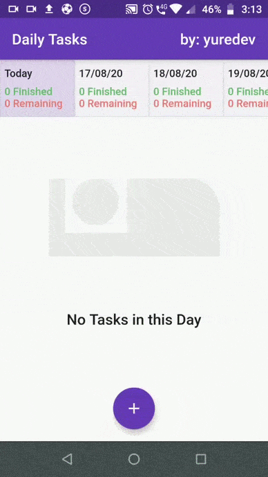
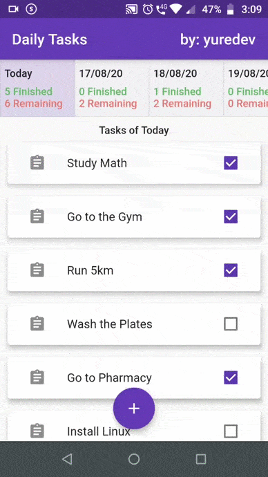

<h1 align="center"> 📲 Daily Tasks App ✔ </h1>

  Aplicativo em Flutter para cadastrar e listar tarefas diárias

<h2 align="center"> Prints: </h2>

  
  

 

&lt;/&gt; by <a href="http://github.com/yuredev">yuredev</a>
